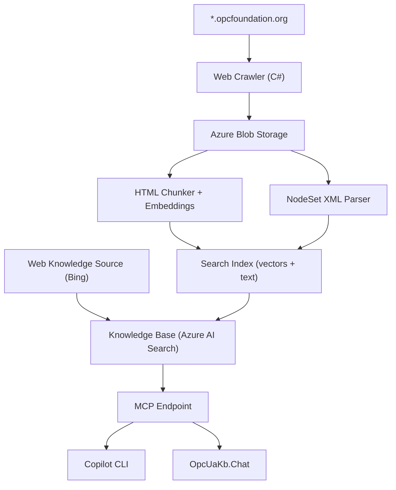

# OPC UA Knowledge Base MCP Server

An Azure AI Search agentic retrieval pipeline that exposes the complete OPC UA reference specifications as an MCP (Model Context Protocol) endpoint for AI agents. Crawls and indexes all content from `*.opcfoundation.org` including specification text, tables, diagrams, and NodeSet XML files.

## Architecture



- **Web Knowledge Source** — Bing Custom Search across `*.opcfoundation.org` for real-time queries
- **Crawl + Index Pipeline** — Downloads all content, chunks HTML, parses NodeSet XMLs, generates vector embeddings, indexes in Azure AI Search
- **NodeSet XML Parser** — Extracts variable definitions with ModellingRule (Mandatory/Optional), data types, and parent types from all companion specifications
- **Knowledge Base** — Orchestrates retrieval from both sources with GPT-4o for query planning and answer synthesis
- **MCP Endpoint** — Automatically exposed by the knowledge base for any MCP-compatible client
- **Monitoring** — Azure Monitor Workbook dashboard with crawl progress, index progress, errors, and execution history

## Projects

| Project | Description |
|---------|-------------|
| `OpcUaKb.Pipeline` | Combined crawl + index + NodeSet parse pipeline (runs as Container Apps Job) |
| `OpcUaKb.Chat` | Interactive console chatbot grounded by the knowledge base |
| `OpcUaKb.Setup` | Creates the Web Knowledge Source, Knowledge Base, and verifies the MCP endpoint |
| `OpcUaKb.Crawler` | Standalone crawler for `*.opcfoundation.org` |
| `OpcUaKb.Indexer` | Standalone HTML chunker + embedder + search indexer |
| `OpcUaKb.Test` | Runs verification queries against the knowledge base |

## Deploy

### One-command deployment

The `infra/deploy.sh` script provisions all Azure resources, builds the Docker image, and configures the knowledge base:

```bash
./infra/deploy.sh \
  -s <subscription-id> \
  -g rg-opcua-kb \
  -p opcua-kb \
  -l eastus
```

Options:

| Flag | Description | Default |
|------|-------------|---------|
| `-s, --subscription` | Azure subscription ID | (required) |
| `-g, --resource-group` | Resource group name | `rg-opcua-kb` |
| `-p, --prefix` | Resource name prefix | `opcua-kb` |
| `-l, --location` | Azure region | `eastus` |

Prerequisites: `az` CLI (logged in), `docker`, `dotnet` SDK 9.0+.

The script is idempotent — safe to run multiple times.

### Azure Resources Provisioned

All resources are defined in `infra/main.bicep`:

| Resource | Derived Name | Purpose |
|----------|-------------|---------|
| AI Search | `{prefix}-search` | Search index + knowledge base + MCP endpoint |
| Azure OpenAI | `{prefix}-openai` | GPT-4o (query planning) + text-embedding-3-large |
| Blob Storage | `{prefix}storage` | Crawled content storage |
| Document Intelligence | `{prefix}-docai` | Rich content extraction |
| Container Registry | `{prefix}registry` | Pipeline Docker image |
| Container Apps Job | `{prefix}-pipeline-job` | Weekly scheduled crawl + index |
| Monitor Workbook | OPC UA Pipeline Dashboard | Crawl/index progress and errors |

### Retrieve API Keys

```bash
# Search API key
az search admin-key show \
  --service-name <prefix>-search \
  --resource-group <resource-group> \
  --query primaryKey -o tsv

# Azure OpenAI API key
az cognitiveservices account keys list \
  --name <prefix>-openai \
  --resource-group <resource-group> \
  --query key1 -o tsv

# Storage connection string
az storage account show-connection-string \
  --name <prefix>storage \
  --resource-group <resource-group> \
  -o tsv
```

## MCP Endpoint

```
https://<prefix>-search.search.windows.net/knowledgebases/<prefix>-kb/mcp?api-version=2025-11-01-preview
```

### Configure in GitHub Copilot CLI

Add to `~/.copilot/mcp.json`:

```json
{
  "mcpServers": {
    "opcua-kb": {
      "type": "http",
      "url": "https://<prefix>-search.search.windows.net/knowledgebases/<prefix>-kb/mcp?api-version=2025-11-01-preview",
      "headers": {
        "api-key": "<your-search-api-key>"
      }
    }
  }
}
```

Get the API key with:
```bash
az search admin-key show --service-name <prefix>-search --resource-group <resource-group> --query primaryKey -o tsv
```

## Interactive Chatbot

```bash
export SEARCH_API_KEY="$(az search admin-key show --service-name <prefix>-search -g <rg> --query primaryKey -o tsv)"
export AOAI_API_KEY="$(az cognitiveservices account keys list --name <prefix>-openai -g <rg> --query key1 -o tsv)"
dotnet run --project src/OpcUaKb.Chat
```

## Manual Pipeline Run

The pipeline runs weekly (Sunday 2am UTC) as a Container Apps Job. To trigger manually:

```bash
# Set environment variables
export STORAGE_CONNECTION_STRING="$(az storage account show-connection-string --name <prefix>storage -g <rg> -o tsv)"
export SEARCH_ENDPOINT="https://<prefix>-search.search.windows.net"
export SEARCH_API_KEY="$(az search admin-key show --service-name <prefix>-search -g <rg> --query primaryKey -o tsv)"
export AOAI_ENDPOINT="https://<prefix>-openai.openai.azure.com"
export AOAI_API_KEY="$(az cognitiveservices account keys list --name <prefix>-openai -g <rg> --query key1 -o tsv)"

# Run locally
dotnet run --project src/OpcUaKb.Pipeline

# Or trigger the cloud job
az containerapp job start --name <prefix>-pipeline-job --resource-group <rg>
```

## CI/CD

GitHub Actions workflow (`.github/workflows/ci.yml`):
- **Push/PR to main** — build + compile all projects
- **Push to main** — build and publish Docker image to `ghcr.io`

## Monitoring

The Azure Monitor Workbook "OPC UA Pipeline Dashboard" provides:
- Pipeline phase transitions and execution history
- Crawl progress (downloaded/queued/errors over time)
- Index progress (chunks/embedded/uploaded)
- Errors and warnings table
- Execution duration bar chart

Access via: **Azure Portal → Monitor → Workbooks → "OPC UA Pipeline Dashboard"**
