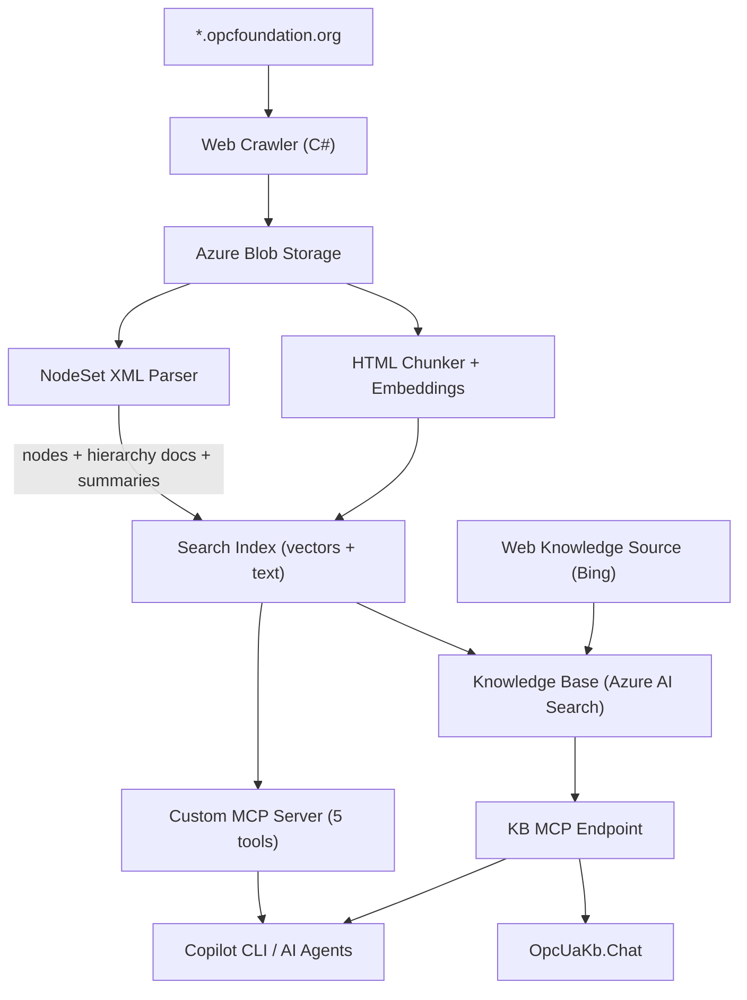

# OPC UA Knowledge Base MCP Server

An Azure AI Search agentic retrieval pipeline that exposes the complete OPC UA reference specifications as MCP (Model Context Protocol) endpoints for AI agents. Crawls and indexes all content from `*.opcfoundation.org` including specification text, tables, diagrams, and NodeSet XML files — with full type hierarchy resolution for ObjectType inheritance.

## Architecture



### Key Features

- **Web Knowledge Source** — Live web retrieval across `*.opcfoundation.org` for real-time queries
- **Crawl + Index Pipeline** — Downloads all content, chunks HTML, parses NodeSet XMLs, generates vector embeddings, indexes in Azure AI Search
- **NodeSet XML Parser** — Extracts node definitions with ModellingRule (Mandatory/Optional), data types, parent types, browse names, and companion spec attribution
- **Type Hierarchy Resolution** — Cross-file ObjectType inheritance with alias/namespace normalization, supertype chain tracking, and declared vs inherited member counting
- **Pre-computed Summaries** — Per-spec and cross-spec aggregation documents + per-ObjectType hierarchy documents for answering "which is the largest?" questions
- **Knowledge Base** — Azure AI Search agentic retrieval with GPT-4o for query planning (medium reasoning effort) and answer synthesis
- **Custom MCP Server** — 5 structured tools for precise NodeSet queries, faceted counts, hierarchy lookup, spec summaries, and documentation search
- **Monitoring** — Azure Monitor Workbook dashboard with crawl progress, index progress, errors, and execution history

## Prerequisites

- [.NET 10 SDK](https://dotnet.microsoft.com/download/dotnet/10.0)
- [Azure CLI](https://learn.microsoft.com/cli/azure/install-azure-cli) (logged in)
- [Docker](https://docs.docker.com/get-docker/) (for container builds)

## Projects

| Project | Description |
|---------|-------------|
| `OpcUaKb.Pipeline` | Combined crawl + index + NodeSet parse pipeline (runs as Container Apps Job) |
| `OpcUaKb.McpServer` | Custom MCP server with 5 structured tools (stdio transport) |
| `OpcUaKb.Chat` | Interactive console chatbot grounded by the knowledge base |
| `OpcUaKb.Setup` | Creates the Web Knowledge Source, Knowledge Base, and verifies the MCP endpoint |
| `OpcUaKb.Crawler` | Standalone crawler for `*.opcfoundation.org` |
| `OpcUaKb.Indexer` | Standalone HTML chunker + embedder + search indexer |
| `OpcUaKb.Test` | Runs verification queries against the knowledge base |

## MCP Tools

The custom MCP server (`OpcUaKb.McpServer`) exposes these tools alongside the Azure AI Search KB endpoint:

| Tool | Description |
|------|-------------|
| `search_nodes` | Structured search with OData filters by node class, spec, parent type, modelling rule |
| `get_type_hierarchy` | ObjectType inheritance chain with declared/inherited member counts |
| `get_spec_summary` | Pre-computed per-spec or cross-spec NodeSet statistics |
| `search_docs` | Full-text search across HTML specification pages and tables |
| `count_nodes` | Faceted aggregation by node_class, spec_part, modelling_rule, or data_type |

### Search Index Fields

| Field | Type | Filterable | Facetable | Description |
|-------|------|-----------|-----------|-------------|
| `browse_name` | String | ✓ | | Node browse name |
| `node_class` | String | ✓ | ✓ | ObjectType, Variable, Method, DataType, etc. |
| `spec_part` | String | ✓ | ✓ | Companion spec name (DI, Pumps, PlasticsRubber, etc.) |
| `parent_type` | String | ✓ | | Parent ObjectType browse name |
| `modelling_rule` | String | ✓ | ✓ | Mandatory, Optional, MandatoryPlaceholder, etc. |
| `data_type` | String | ✓ | ✓ | OPC UA data type |
| `content_type` | String | ✓ | | nodeset, nodeset_summary, nodeset_hierarchy, text, table, diagram |

### Content Types

| Type | Count | Description |
|------|-------|-------------|
| `text`, `table`, `diagram` | ~47K | HTML spec pages (text chunks, tables, diagrams) |
| `nodeset` | ~88K | Individual NodeSet nodes (one per Variable/Method/ObjectType/etc.) |
| `nodeset_summary` | ~66 | Per-spec + master aggregation docs |
| `nodeset_hierarchy` | ~3K | Per-ObjectType docs with supertype chain and member counts |

## Deploy

### One-command deployment

The `infra/deploy.sh` script provisions all Azure resources, builds the Docker image, and configures the knowledge base:

```bash
./infra/deploy.sh \
  -s <subscription-id> \
  -g rg-opcua-kb \
  -p opcua-kb \
  -l eastus
```

Options:

| Flag | Description | Default |
|------|-------------|---------|
| `-s, --subscription` | Azure subscription ID | (required) |
| `-g, --resource-group` | Resource group name | `rg-opcua-kb` |
| `-p, --prefix` | Resource name prefix | `opcua-kb` |
| `-l, --location` | Azure region | `eastus` |

Prerequisites: `az` CLI (logged in), `docker`, `dotnet` SDK 10.0+.

The script is idempotent — safe to run multiple times.

### Azure Resources Provisioned

All resources are defined in `infra/main.bicep`:

| Resource | Derived Name | Purpose |
|----------|-------------|---------|
| AI Search (Standard) | `{prefix}-search` | Search index + knowledge base + MCP endpoint |
| Azure OpenAI | `{prefix}-openai` | GPT-4o (30 TPM) + text-embedding-3-large (120 TPM) |
| Blob Storage | `{prefix}storage` | Crawled content storage |
| Container Registry | `{prefix}registry` | Pipeline Docker image |
| Container Apps Job | `{prefix}-pipeline-job` | Weekly scheduled crawl + index (cron: `0 2 * * 0`, 24h timeout) |

### Retrieve API Keys

```bash
# Search API key
az search admin-key show \
  --service-name <prefix>-search \
  --resource-group <resource-group> \
  --query primaryKey -o tsv

# Azure OpenAI API key
az cognitiveservices account keys list \
  --name <prefix>-openai \
  --resource-group <resource-group> \
  --query key1 -o tsv

# Storage connection string
az storage account show-connection-string \
  --name <prefix>storage \
  --resource-group <resource-group> \
  -o tsv
```

## MCP Endpoints

### Azure AI Search KB (RAG with answer synthesis)

```
https://<prefix>-search.search.windows.net/knowledgebases/<prefix>-kb/mcp?api-version=2025-11-01-preview
```

### Custom MCP Server (structured tools)

Hosted on Azure Container Apps with scale-to-zero (0–2 replicas, HTTP auto-scale at 5 concurrent requests). Requires `api-key` header for authentication (uses the same Search API key).

```
https://<mcp-server-fqdn>/
```

Can also run locally via stdio transport for development (no auth needed):

```bash
SEARCH_ENDPOINT=https://<prefix>-search.search.windows.net \
SEARCH_API_KEY=<key> \
dotnet run --project src/OpcUaKb.McpServer -- --stdio
```

### Configure in GitHub Copilot CLI

Add to `~/.copilot/mcp.json`:

```json
{
  "mcpServers": {
    "opcua-kb": {
      "type": "http",
      "url": "https://<prefix>-search.search.windows.net/knowledgebases/<prefix>-kb/mcp?api-version=2025-11-01-preview",
      "headers": {
        "api-key": "<your-search-api-key>"
      }
    },
    "opcua-kb-tools": {
      "type": "http",
      "url": "https://<mcp-server-fqdn>/",
      "headers": {
        "api-key": "<your-search-api-key>"
      }
    }
  }
}
```

## Interactive Chatbot

```bash
export SEARCH_API_KEY="$(az search admin-key show --service-name <prefix>-search -g <rg> --query primaryKey -o tsv)"
export AOAI_API_KEY="$(az cognitiveservices account keys list --name <prefix>-openai -g <rg> --query key1 -o tsv)"
dotnet run --project src/OpcUaKb.Chat
```

## Manual Pipeline Run

The pipeline runs weekly (Sunday 2am UTC) as a Container Apps Job with a 24-hour timeout. It executes three phases:

1. **Crawl** — BFS crawl of `reference.opcfoundation.org` (full) + `profiles.opcfoundation.org` (full) + other `*.opcfoundation.org` (depth 1). Content stored in Azure Blob Storage with incremental state tracking.
2. **Index** — Parse HTML into chunks, generate vector embeddings via `text-embedding-3-large` (120K TPM), upload to Azure AI Search with semantic ranking.
3. **NodeSet** — Parse NodeSet XML files, build type hierarchy with cross-file inheritance resolution, generate per-ObjectType hierarchy documents and per-spec summary documents, upload all to index.

All HTTP calls include retry logic with exponential backoff for 429/503 errors.

To trigger manually:

```bash
# Set environment variables
export STORAGE_CONNECTION_STRING="$(az storage account show-connection-string --name <prefix>storage -g <rg> -o tsv)"
export SEARCH_ENDPOINT="https://<prefix>-search.search.windows.net"
export SEARCH_API_KEY="$(az search admin-key show --service-name <prefix>-search -g <rg> --query primaryKey -o tsv)"
export AOAI_ENDPOINT="https://<prefix>-openai.openai.azure.com"
export AOAI_API_KEY="$(az cognitiveservices account keys list --name <prefix>-openai -g <rg> --query key1 -o tsv)"

# Run locally
dotnet run --project src/OpcUaKb.Pipeline

# Or trigger the cloud job
az containerapp job start --name <prefix>-pipeline-job --resource-group <rg>
```

## CI/CD

GitHub Actions workflow (`.github/workflows/ci.yml`):
- **Push/PR to main** — build + compile all projects
- **Push to main** — build and publish Docker image to `ghcr.io`

## Monitoring

The Azure Monitor Workbook "OPC UA Pipeline Dashboard" provides:
- Pipeline phase transitions and execution history
- Crawl progress (downloaded/queued/errors over time)
- Index progress (chunks/embedded/uploaded)
- Errors and warnings table
- Execution duration bar chart

Access via: **Azure Portal → Monitor → Workbooks → "OPC UA Pipeline Dashboard"**
