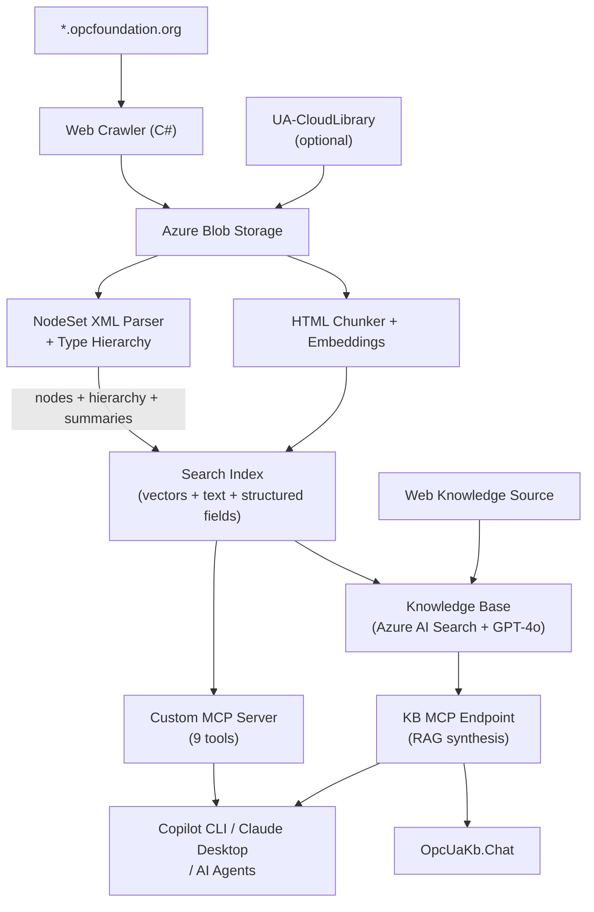

# OPC UA Knowledge Base MCP Server

[](https://github.com/marcschier/OpcUaKb/actions/workflows/ci.yml)
[](LICENSE)
[](https://dotnet.microsoft.com/download/dotnet/10.0)
[](https://modelcontextprotocol.io)
[](version.json)

An Azure AI Search agentic retrieval pipeline that exposes the complete OPC UA reference specifications as MCP (Model Context Protocol) endpoints for AI agents. Crawls and indexes all content from `*.opcfoundation.org` including specification text, tables, diagrams, and NodeSet XML files — with full type hierarchy resolution, version-aware indexing, compliance validation tools, and optional [UA-CloudLibrary](https://uacloudlibrary.opcfoundation.org) integration.

## Architecture



### Key Features

- **Web Knowledge Source** — Live web retrieval across `*.opcfoundation.org` for real-time queries
- **Crawl + Index Pipeline** — Downloads all content, chunks HTML, parses NodeSet XMLs, generates vector embeddings, indexes in Azure AI Search
- **Version-Aware Indexing** — Scrapes the spec version catalog; tags every document with `is_latest` and `version_rank`. Queries default to the latest version with automatic fallback to older versions. Supports querying specific versions, previous version, oldest, or all versions.
- **NodeSet XML Parser** — Extracts node definitions with ModellingRule, data types, parent types, browse names, and companion spec attribution
- **Type Hierarchy Resolution** — Cross-file ObjectType inheritance with alias/namespace normalization, supertype chain tracking, and declared vs inherited member counting
- **Pre-computed Summaries** — Per-spec and cross-spec aggregation documents + per-ObjectType hierarchy documents for answering "which is the largest?" questions
- **UA-CloudLibrary Integration** *(optional)* — Downloads NodeSet XMLs from the [OPC Foundation Cloud Library](https://uacloudlibrary.opcfoundation.org), indexed separately as `cloudlib_nodeset` content type
- **Compliance Tools** — Validate NodeSet XMLs against OPC 11030 best practices, check implementations against companion specs, compare spec versions for breaking changes, suggest information model designs
- **Knowledge Base** — Azure AI Search agentic retrieval with GPT-4o for query planning (medium reasoning effort) and answer synthesis
- **Custom MCP Server** — 9 tools with API key auth, hosted on Azure Container Apps with scale-to-zero. Supports HTTP/SSE (hosted) and stdio (local) transports.
- **Git Versioning** — Nerdbank.GitVersioning for deterministic SemVer; container images tagged with version + SHA
- **Monitoring** — Azure Monitor Workbook dashboard with crawl progress, index progress, errors, and execution history

## Prerequisites

- [.NET 10 SDK](https://dotnet.microsoft.com/download/dotnet/10.0)
- [Azure CLI](https://learn.microsoft.com/cli/azure/install-azure-cli) (logged in)
- [Docker](https://docs.docker.com/get-docker/) (for container builds)
- [nbgv](https://github.com/dotnet/Nerdbank.GitVersioning) (`dotnet tool install -g nbgv`)

## Projects

| Project | Description |
|---------|-------------|
| `OpcUaKb.Pipeline` | Combined crawl + index + NodeSet parse pipeline (runs as Container Apps Job) |
| `OpcUaKb.McpServer` | Custom MCP server with 9 tools — search, compliance, modelling (HTTP + stdio) |
| `OpcUaKb.Chat` | Interactive console chatbot grounded by the knowledge base |
| `OpcUaKb.Setup` | Creates the Web Knowledge Source, Knowledge Base, and verifies the MCP endpoint |
| `OpcUaKb.Crawler` | Standalone crawler for `*.opcfoundation.org` |
| `OpcUaKb.Indexer` | Standalone HTML chunker + embedder + search indexer |
| `OpcUaKb.Test` | Runs verification queries against the knowledge base |

## MCP Tools

The custom MCP server (`OpcUaKb.McpServer`) exposes 9 tools alongside the Azure AI Search KB endpoint:

### Search & Discovery

| Tool | Description |
|------|-------------|
| `search_nodes` | Structured search with OData filters by node class, spec, parent type, modelling rule. Version-aware with two-pass fallback. |
| `get_type_hierarchy` | ObjectType inheritance chain with declared/inherited member counts and supertype chain |
| `get_spec_summary` | Pre-computed per-spec or cross-spec NodeSet statistics (node counts, top ObjectTypes) |
| `search_docs` | Full-text search across HTML specification pages, tables, and diagrams. Version-aware. |
| `count_nodes` | Faceted aggregation by node_class, spec_part, modelling_rule, or data_type |

### Compliance & Modelling

| Tool | Description |
|------|-------------|
| `validate_nodeset` | Validate NodeSet XML against OPC UA standard and OPC 11030 best practices — checks naming conventions, modelling rules, type hierarchy, reference types |
| `compare_versions` | Compare two versions of a companion spec, classify changes as backward-compatible or breaking per OPC 11030 §3 |
| `check_compliance` | Check a NodeSet implementation against a companion spec — finds missing mandatory/optional nodes, data type mismatches |
| `suggest_model` | Suggest OPC UA information model design based on a domain description, recommending base types from DI/Machinery/IA and OPC 11030 best practices |

### Version Filtering

All search tools default to the **latest spec version** with automatic fallback to older versions if too few results. Use these parameters to control:

| Parameter | Values | Effect |
|-----------|--------|--------|
| `version_mode` | `latest` (default) | Only current version |
| | `previous` | One version before latest |
| | `oldest` | Earliest available version |
| | `all` | Search across all versions |
| `spec_version` | `v104`, `v105`, `v200`, etc. | Specific version (overrides `version_mode`) |

### Search Index Fields

| Field | Type | Filterable | Facetable | Description |
|-------|------|-----------|-----------|-------------|
| `browse_name` | String | ✓ | | Node browse name |
| `node_class` | String | ✓ | ✓ | ObjectType, Variable, Method, DataType, etc. |
| `spec_part` | String | ✓ | ✓ | Companion spec name (DI, Pumps, Part3, etc.) |
| `spec_version` | String | ✓ | | Version path segment (v104, v105, v200) |
| `parent_type` | String | ✓ | | Parent ObjectType browse name |
| `modelling_rule` | String | ✓ | ✓ | Mandatory, Optional, MandatoryPlaceholder, etc. |
| `data_type` | String | ✓ | ✓ | OPC UA data type |
| `content_type` | String | ✓ | | nodeset, nodeset_summary, nodeset_hierarchy, cloudlib_nodeset, text, table, diagram |
| `is_latest` | Boolean | ✓ | | `true` for the latest version of each spec |
| `version_rank` | Int32 | ✓ | | 1 = latest, 2 = previous, 3 = older, etc. |

### Content Types

| Type | Description |
|------|-------------|
| `text`, `table`, `diagram` | HTML spec pages (text chunks, tables, diagrams) |
| `nodeset` | Individual NodeSet nodes from standard specs |
| `nodeset_summary` | Per-spec + master aggregation docs |
| `nodeset_hierarchy` | Per-ObjectType docs with supertype chain and member counts |
| `cloudlib_nodeset` | NodeSet nodes from UA-CloudLibrary (optional) |
| `cloudlib_summary` | CloudLibrary aggregation docs (optional) |

## Deploy

### One-command deployment

```bash
./infra/deploy.sh \
  -s <subscription-id> \
  -g rg-opcua-kb \
  -p opcua-kb \
  -l eastus
```

| Flag | Description | Default |
|------|-------------|---------|
| `-s, --subscription` | Azure subscription ID | (required) |
| `-g, --resource-group` | Resource group name | `rg-opcua-kb` |
| `-p, --prefix` | Resource name prefix | `opcua-kb` |
| `-l, --location` | Azure region | `eastus` |

Prerequisites: `az` CLI (logged in), `docker`, `dotnet` SDK 10.0+, `nbgv`.
The script is idempotent — safe to run multiple times.

### Azure Resources

All resources are defined in `infra/main.bicep`:

| Resource | Derived Name | Purpose |
|----------|-------------|---------|
| AI Search (Standard) | `{prefix}-search` | Search index + knowledge base + MCP endpoint |
| Azure OpenAI | `{prefix}-openai` | GPT-4o (30 TPM) + text-embedding-3-large (120 TPM) |
| Blob Storage | `{prefix}storage` | Crawled content storage |
| Container Registry | `{prefix}registry` | Pipeline + MCP server Docker images |
| Container Apps Job | `{prefix}-pipeline-job` | Weekly crawl + index (cron: `0 2 * * 0`, 24h timeout) |
| Container App | `{prefix}-mcp-server` | Hosted MCP server (scale 0–2, HTTP auto-scale) |

## Quick Install

### One-command setup (hosted — recommended)

```bash
# PowerShell
.\scripts\install-mcp.ps1 -Mode hosted -ApiKey <your-search-api-key>

# Bash
SEARCH_API_KEY=<your-search-api-key> ./scripts/install-mcp.sh hosted
```

This configures both GitHub Copilot CLI and Claude Desktop (if installed) to use the hosted MCP endpoints. No local install needed.

### Install as dotnet tool (local stdio)

```bash
# Install the tool globally
dotnet tool install -g OpcUaKb.McpServer

# Configure clients for local mode
.\scripts\install-mcp.ps1 -Mode local -ApiKey <your-search-api-key>
```

The tool runs as `opcua-kb-mcp --stdio` and communicates over stdin/stdout.

## MCP Endpoints

### Azure AI Search KB (RAG with answer synthesis)

```
https://<prefix>-search.search.windows.net/knowledgebases/<prefix>-kb/mcp?api-version=2025-11-01-preview
```

### Custom MCP Server (9 structured tools)

Hosted on Azure Container Apps with scale-to-zero. Requires `api-key` header.

```
https://<mcp-server-fqdn>/
```

Local via dotnet tool:

```bash
opcua-kb-mcp --stdio
```

Or from source:

```bash
SEARCH_ENDPOINT=https://<prefix>-search.search.windows.net \
SEARCH_API_KEY=<key> \
dotnet run --project src/OpcUaKb.McpServer -- --stdio
```

### Manual Configuration: GitHub Copilot CLI

Add to `~/.copilot/mcp.json`:

```json
{
  "mcpServers": {
    "opcua-kb": {
      "type": "http",
      "url": "https://<prefix>-search.search.windows.net/knowledgebases/<prefix>-kb/mcp?api-version=2025-11-01-preview",
      "headers": { "api-key": "<your-search-api-key>" }
    },
    "opcua-kb-tools": {
      "type": "http",
      "url": "https://<mcp-server-fqdn>/",
      "headers": { "api-key": "<your-search-api-key>" }
    }
  }
}
```

### Manual Configuration: Claude Desktop

Add to `claude_desktop_config.json`:

```json
{
  "mcpServers": {
    "opcua-kb-tools": {
      "command": "opcua-kb-mcp",
      "args": ["--stdio"],
      "env": {
        "SEARCH_ENDPOINT": "https://<prefix>-search.search.windows.net",
        "SEARCH_API_KEY": "<your-search-api-key>"
      }
    }
  }
}
```

## Interactive Chatbot

```bash
export SEARCH_API_KEY="$(az search admin-key show --service-name <prefix>-search -g <rg> --query primaryKey -o tsv)"
export AOAI_API_KEY="$(az cognitiveservices account keys list --name <prefix>-openai -g <rg> --query key1 -o tsv)"
dotnet run --project src/OpcUaKb.Chat
```

## Pipeline

The pipeline runs weekly (Sunday 2am UTC) as a Container Apps Job with a 24-hour timeout:

| Phase | Description |
|-------|-------------|
| **1. Crawl** | BFS crawl of `reference.opcfoundation.org` + `profiles.opcfoundation.org` + other `*.opcfoundation.org` subdomains. Incremental with state tracking. |
| **2. Index** | Parse HTML → chunks, generate embeddings via `text-embedding-3-large` (120K TPM), upload to Azure AI Search. Version catalog built from crawled main page. |
| **3. NodeSet** | Parse NodeSet XMLs, build cross-file type hierarchy, generate per-ObjectType hierarchy docs + per-spec summaries. |
| **4. CloudLibrary** *(optional)* | If `CLOUDLIB_USERNAME` + `CLOUDLIB_PASSWORD` set, download all NodeSets from [UA-CloudLibrary](https://uacloudlibrary.opcfoundation.org), parse and index separately as `cloudlib_*` content types. |

All HTTP calls include retry logic with exponential backoff for 429/503 errors.

### Run manually

```bash
# Required
export STORAGE_CONNECTION_STRING="$(az storage account show-connection-string --name <prefix>storage -g <rg> -o tsv)"
export SEARCH_ENDPOINT="https://<prefix>-search.search.windows.net"
export SEARCH_API_KEY="$(az search admin-key show --service-name <prefix>-search -g <rg> --query primaryKey -o tsv)"
export AOAI_ENDPOINT="https://<prefix>-openai.openai.azure.com"
export AOAI_API_KEY="$(az cognitiveservices account keys list --name <prefix>-openai -g <rg> --query key1 -o tsv)"

# Optional: UA-CloudLibrary integration
export CLOUDLIB_USERNAME="your-email@example.com"
export CLOUDLIB_PASSWORD="your-password"

# Run locally
dotnet run --project src/OpcUaKb.Pipeline

# Or trigger the cloud job
az containerapp job start --name <prefix>-pipeline-job --resource-group <rg>
```

## CI/CD

GitHub Actions workflow (`.github/workflows/ci.yml`):
- **Push/PR to main** — build + compile all projects (full git history for NBGV)
- **Push to main** — build both Docker images (pipeline + MCP server), push to GHCR with SemVer tags

Container image tags: `<version>` (e.g., `2.1.0`) + `latest` + `<sha>`

## Monitoring

The Azure Monitor Workbook "OPC UA Pipeline Dashboard" provides:
- Pipeline phase transitions and execution history
- Crawl progress (downloaded/queued/errors over time)
- Index progress (chunks/embedded/uploaded)
- Errors and warnings table
- Execution duration bar chart

Access via: **Azure Portal → Monitor → Workbooks → "OPC UA Pipeline Dashboard"**
