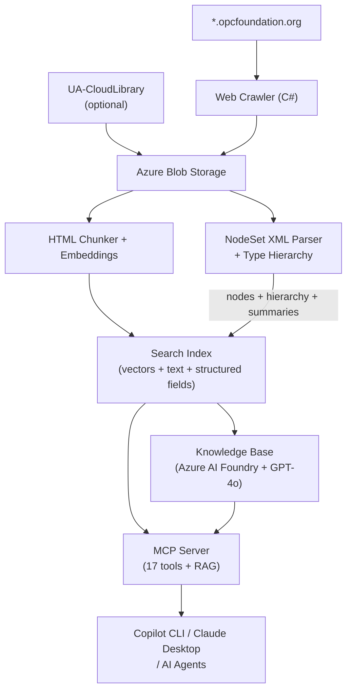

# OPC UA Knowledge Base MCP Server


[](https://github.com/marcschier/OpcUaKb/actions/workflows/ci.yml)
[](LICENSE)
[](https://dotnet.microsoft.com/download/dotnet/10.0)
[](https://modelcontextprotocol.io)
[](version.json)

<br clear="left"/>

An Azure AI Search agentic retrieval pipeline that exposes the complete OPC UA reference specifications as MCP endpoints for AI agents. Uses Azure AI Foundry with Managed Identity for keyless authentication.

## ✨ Key Features

🌐 **Comprehensive OPC UA coverage** — Over 180,000 indexed documents spanning the entire OPC Foundation reference library: specification text, tables, diagrams, and NodeSet XML definitions. Instead of manually searching across dozens of spec PDFs and web pages, your AI agent can query the full corpus in seconds.

🔧 **17 purpose-built MCP tools** — RAG Q&A, structured search, compliance validation, version comparison, information model design suggestions, profile-graph conformance, and asynchronous live-server → companion-spec projection — all accessible via a single MCP endpoint. AI agents can ask natural language questions, find specific ObjectTypes, check a NodeSet against a companion spec, or get help designing a new information model without leaving their workflow.

🏢 **Microsoft 365 Copilot agent** — Use the Knowledge Base directly from Microsoft Teams and Microsoft 365 Copilot Chat. The hosted agent in [`src/OpcUaKb.HostedAgent/`](src/OpcUaKb.HostedAgent/) is a **Foundry Hosted Agent** using the **Responses protocol** + the **Microsoft Agent Framework**. It connects directly to the `OpcUaKb.McpServer` via `ModelContextProtocol.Client`, so each of the 17 MCP tools is a distinct AIFunction the model can call by name.

🧬 **Type hierarchy resolution** — Cross-file ObjectType inheritance is fully resolved with alias and namespace normalization. Every ObjectType includes its complete supertype chain, declared member counts, and inherited member totals. This is the kind of deep structural insight that's tedious to extract manually from XML files.

📊 **Version-aware indexing** — Every document is tagged with `is_latest` and `version_rank`, so queries default to the current spec version but can target any historical version. When a spec is updated, you can compare versions side-by-side to identify breaking changes per OPC 11030 §3.

☁️ **UA-CloudLibrary integration** — Downloads and indexes 450+ NodeSets from the [OPC Foundation Cloud Library](https://uacloudlibrary.opcfoundation.org), complete with download counts, publication dates, and version metadata. A single `list_specs` call shows which CloudLib entries overlap with official companion specs and where versions differ.

🧠 **RAG knowledge base** — Azure AI Foundry with GPT-4o provides natural-language query planning and answer synthesis. Ask a question in plain English and get a grounded answer with references to specific specification sections — useful for both newcomers learning OPC UA and experts looking up details quickly.

🔒 **Keyless authentication** — The entire stack uses Managed Identity for Azure OpenAI and Storage access. No connection strings to rotate or leak — the pipeline, MCP server, and mapping worker all authenticate automatically via `DefaultAzureCredential` (storage is MI-only, `allowSharedKeyAccess: false`).

🛡️ **Secure-MCP-baseline ready** — Ships **secure-by-default-capable but non-breaking**. An opt-in `MCP_AUTH_MODE=entra` turns on Entra ID bearer authentication (RFC 9728 Protected Resource Metadata + audience-validated tokens, no passthrough), and an optional Azure **Front Door + WAF + Key Vault** edge (`infra/edge.bicep`) provides DDoS mitigation and traffic normalization. The default `apikey` mode preserves existing anonymous + api-key behaviour. See [`SECURITY.md`](SECURITY.md).

📈 **Popularity-boosted ranking** — Search results are ranked using a scoring profile that combines text relevance with adoption signals. OPC Foundation specs receive baseline priority; CloudLibrary entries are boosted by their download count on a logarithmic scale, so widely-adopted NodeSets like DI, Machinery, and PackML naturally surface first.

## 🏗️ Architecture


```mermaid
graph TD
    OPC["*.opcfoundation.org"] --> Crawler["Web Crawler (C#)"]
    CloudLib["UA-CloudLibrary<br/>(optional)"] --> Blob
    Crawler --> Blob["Azure Blob Storage"]
    Blob --> Chunker["HTML Chunker + Embeddings"]
    Blob --> NodeSet["NodeSet XML Parser<br/>+ Type Hierarchy"]
    Chunker --> Index["Search Index<br/>(vectors + text + structured fields)"]
    NodeSet --> |"nodes + hierarchy + summaries"| Index
    Index --> McpServer["MCP Server<br/>(17 tools + RAG)"]
    Index --> KB["Knowledge Base<br/>(Azure AI Foundry + GPT-4o)"]
    KB --> McpServer
    McpServer --> Clients["Copilot CLI / Claude Desktop<br/>/ AI Agents"]
```

## 🔌 MCP Tools

The MCP server exposes 17 tools — structured search, RAG Q&A, compliance validation, modelling, the profile graph, and live-server semantic projection:

### 🔍 Search & Discovery

<table>
<tr>
<td width="50%" valign="top">

**`search_nodes`** — Structured search with OData filters by node class, spec, parent type, modelling rule, and `source`. Version-aware with two-pass fallback.

</td>
<td width="50%" valign="top">

**`search_docs`** — Full-text search across HTML specification pages, tables, and diagrams. Version-aware.

</td>
</tr>
<tr>
<td valign="top">

**`get_type_hierarchy`** — ObjectType inheritance chain with declared/inherited member counts and supertype chain.

</td>
<td valign="top">

**`get_spec_summary`** — Pre-computed per-spec or cross-spec NodeSet statistics (node counts, top ObjectTypes). Filterable by `source`.

</td>
</tr>
<tr>
<td valign="top">

**`count_nodes`** — Faceted aggregation by node_class, spec_part, modelling_rule, data_type, or `source`.

</td>
<td valign="top">

**`list_specs`** — Ranked catalog with version, node count, popularity, and cross-source version comparison. Use `unique_to_source=true` to find CloudLib NodeSets not in the official index or with different versions.

</td>
</tr>
<tr>
<td valign="top" colspan="2">

**`search_docs_rag`** — Ask a natural language question about OPC UA and get an AI-synthesized answer grounded by the knowledge base. Uses KB retrieval + GPT-4o. Best for conceptual questions, protocol details, and security models.

</td>
</tr>
</table>

### 🛡️ Compliance & Modelling

<table>
<tr>
<td width="50%" valign="top">

**`validate_nodeset`** — Validate NodeSet XML against OPC UA standard and OPC 11030 best practices — checks naming conventions, modelling rules, type hierarchy, reference types. Streaming parser; accepts inline XML (≤30 KB), `blob:` refs, or allow-listed `https://` URLs.

</td>
<td width="50%" valign="top">

**`compare_versions`** — Compare two versions of a companion spec, classify changes as backward-compatible or breaking per OPC 11030 §3.

</td>
</tr>
<tr>
<td valign="top">

**`check_compliance`** — Check a NodeSet implementation against a companion spec — finds missing mandatory/optional nodes, data type mismatches. Same three input modes as `validate_nodeset` (inline / `blob:` ref / `https://` URL).

</td>
<td valign="top">

**`suggest_model`** — Suggest OPC UA information model design based on a domain description, recommending base types from DI/Machinery/IA and OPC 11030 best practices.

</td>
</tr>
</table>

### 🕸️ Profile Graph & Conformance

Backed by the `profiles` pipeline phase, which crawls [profiles.opcfoundation.org](https://profiles.opcfoundation.org) into a navigable graph (profiles, categories, conformance units/groups + include/conformance edges) tagged by release status. Profile tools default to **Released** profiles; widen with `status` = `rc` / `draft` / `all`.

<table>
<tr>
<td width="50%" valign="top">

**`list_profile_groups`** — List spec+version profile groups (e.g. `UACore 1.05`, `DI 1.05`) with per-group profile / conformance-unit counts and release-status mix.

</td>
<td width="50%" valign="top">

**`get_profile`** — A single profile's neighborhood: description, status, group, required conformance units (mandatory vs optional), profiles it includes, and profiles that include it (reverse edges).

</td>
</tr>
<tr>
<td valign="top">

**`query_profiles`** — Graph query: filter profiles by name fragment, group, and status, then optionally expand `includes` / `included_by` relationships.

</td>
<td valign="top">

**`check_profile_conformance`** — Conformance analysis in three modes: `expand` (transitive required/optional conformance units + included profiles), `satisfy` (which profiles a set of supported conformance units fulfils), `diff` (conformance-unit/include differences between two profiles).

</td>
</tr>
</table>

### 🔄 Live Server → Companion-Spec Projection

These tools accept a full NodeSet2 export from a live OPC UA server, analyze names, descriptions, data types and structure, ignore OPC UA Core infrastructure, and create one or more high-confidence semantic projections onto the latest official companion specifications. The workflow is asynchronous because large AddressSpaces can require extensive model search and semantic analysis.

<table>
<tr>
<td width="50%" valign="top">

**`create_companion_projection`** — Submit a NodeSet through the same inline / `blob:` / allow-listed URL input modes. Stages the input privately, queues a durable mapping job, and returns a job ID **promptly** (`blob:`/URL inputs are staged by the worker, so the call never blocks on blob round-trips). Target NodeIds are deterministic; unrelated strong matches may produce multiple companion-spec projections for the same source node.

</td>
<td width="50%" valign="top">

**`get_companion_projection`** — Poll job progress and retrieve the generated NodeSet2 XML, canonical node-to-node mapping JSON, CSV mapping, reports, and ZIP bundle. Results include private blob references and authenticated streaming download URLs.

</td>
</tr>
</table>

The generated NodeSet contains instances with exact `HasTypeDefinition` and `<RequiredModel>` references. Only high-confidence mappings are emitted; medium-confidence candidates and unresolved nodes stay in the report for review. Gateway binding direction is inferred from source access metadata: reads are forwarded, writes require write access, and mapped Methods are forwarded.

### Version Filtering

All search tools default to the **latest spec version** with automatic fallback to older versions if too few results:

| Parameter | Values | Effect |
|-----------|--------|--------|
| `version_mode` | `latest` (default) | Only current version |
| | `previous` | One version before latest |
| | `oldest` | Earliest available version |
| | `all` | Search across all versions |
| | `v104`, `v105`, `v200`, etc. | A specific spec version |

## 🚀 Deploy

```bash
./infra/deploy.sh -s <subscription-id> -g rg-opcua-kb -p opcua-kb -l eastus
```

The script is idempotent. See [`infra/README.md`](infra/README.md) for full resource details, Bicep structure, and monitoring.

`infra/deploy.sh` provisions a separate MCP application key instead of exposing the Azure AI Search admin key to custom-MCP clients. It preserves the key on idempotent redeploys and writes the local copy to ignored `.session/mcp-access-key.txt`.

## 📦 Quick Install

```bash
# Hosted mode (recommended) — configures Copilot CLI + Claude Desktop
.\scripts\install-mcp.ps1 -Mode hosted `
  -SearchApiKey <your-search-api-key> `
  -McpApiKey <your-mcp-application-key>

# Or install as local dotnet tool
dotnet tool install -g OpcUaKb.McpServer
.\scripts\install-mcp.ps1 -Mode local -SearchApiKey <your-search-api-key>
```

See [`scripts/README.md`](scripts/README.md) for manual configuration and all client setup options.

## 🔗 MCP Endpoint

Single endpoint for all tools including RAG Q&A:

```
https://<mcp-server-fqdn>/
```

| Tier | Identification | Default Limit |
|------|---------------|---------------|
| Authenticated | Valid `api-key` header | Unlimited |
| Anonymous | No key (per IP) | 100 req/min |
| Blocked | `MCP_REQUIRE_AUTH=true` | 401 Unauthorized |

All tool calls — including `create_companion_projection` — follow the tier table above: they work anonymously unless `MCP_REQUIRE_AUTH=true`. The HTTP write endpoints `POST /upload-nodeset` and `GET /mapping-artifacts/...` always require the `api-key` header (upload/artifact keys), independent of the anonymous tier.

### 🛡️ Hardened (Entra ID) mode

The default `MCP_AUTH_MODE=apikey` behaviour above is unchanged. Setting `MCP_AUTH_MODE=entra` switches the server to **Entra ID bearer authentication** — every request except discovery (`/.well-known/*`) must present a valid token **issued for this server** (audience-validated, no passthrough), optionally gated on a required `scp`. The server publishes RFC 9728 Protected Resource Metadata and challenges with `WWW-Authenticate`. An optional `MCP_FRONTDOOR_ID` locks ingress so only requests arriving through the approved Front Door edge are accepted. Full compliance matrix, env vars, Entra app registration, and non-breaking cutover order are in [`SECURITY.md`](SECURITY.md); the edge (Front Door + WAF + Key Vault) is deployed via [`infra/edge.bicep`](infra/edge.bicep).

## 🤖 Microsoft 365 Copilot Agent

A **Foundry Hosted Agent** (`src/OpcUaKb.HostedAgent/`) lets you use the OPC UA Knowledge Base inside **Microsoft Teams** and **Microsoft 365 Copilot** as a conversational bot. It runs on Azure AI Foundry's managed agent runtime using the Responses protocol and connects directly to `OpcUaKb.McpServer` via `ModelContextProtocol.Client` — each MCP tool is exposed as a distinct `AIFunction` so GPT-4o can pick by name.

> **Region** — Foundry Hosted Agents are in preview and only available in select regions (**westus3**, westus, norwayeast, francecentral, japaneast). The recommended deployment colocates KB + Hosted Agent in **westus3** under a single `rg-opcua-kb` resource group.

```bash
# Provision Foundry + deploy hosted agent in the same RG as the KB
cd src/OpcUaKb.HostedAgent
azd env new opcua-kb
azd env set AZURE_LOCATION westus3
azd env set AZURE_RESOURCE_GROUP rg-opcua-kb
azd env set ENABLE_HOSTED_AGENTS true
azd env set MCP_SERVER_URL https://<your-mcp-server-fqdn>/
azd provision
azd deploy
```

`azd provision` creates the Foundry account, project, ACR, App Insights, and the gpt-4o model deployment. `azd deploy` builds the container in ACR remotely and creates a new agent version with its own Entra agent identity. See [`src/OpcUaKb.HostedAgent/README.md`](src/OpcUaKb.HostedAgent/README.md) for full details.

| Channel | Status |
|---|---|
| Foundry Playground (testing) | ✅ |
| `azd ai agent invoke` (CLI) | ✅ |
| Microsoft Teams (personal, group, channel) | ✅ via Foundry Agent Application + Activity bridge |
| Microsoft 365 Copilot Chat | ✅ via Foundry Agent Application |

## 💬 Local Development

For local interactive testing, run the hosted agent against your Foundry project:

```bash
# Run the agent locally — connects directly to the MCP server over HTTPS
cd src/OpcUaKb.HostedAgent
azd auth login
azd ai agent run                                    # starts the container locally on port 8088
azd ai agent invoke --local "What is Part 9?"      # sends a test query
```

The agent uses `DefaultAzureCredential` to authenticate against Foundry. Required env vars (see `.env.example`): `FOUNDRY_PROJECT_ENDPOINT`, `AZURE_AI_MODEL_DEPLOYMENT_NAME`, `MCP_SERVER_URL`.

## ⚙️ Pipeline

Weekly crawl + index pipeline (Sunday 2am UTC, Container Apps Job, 24h timeout):

| Phase | Description |
|-------|-------------|
| **Crawl** | BFS crawl of `*.opcfoundation.org`. Incremental with state tracking. |
| **Index** | HTML → chunks → embeddings (`text-embedding-3-large`) → Azure AI Search. |
| **NodeSet** | Parse XMLs, build type hierarchy, generate summaries + hierarchy docs. |
| **CloudLib** *(optional)* | Download 450+ NodeSets from [UA-CloudLibrary](https://uacloudlibrary.opcfoundation.org), index as `cloudlib_*` content types. |

See [`src/README.md`](src/README.md) for running locally, project details, and search index schema.
